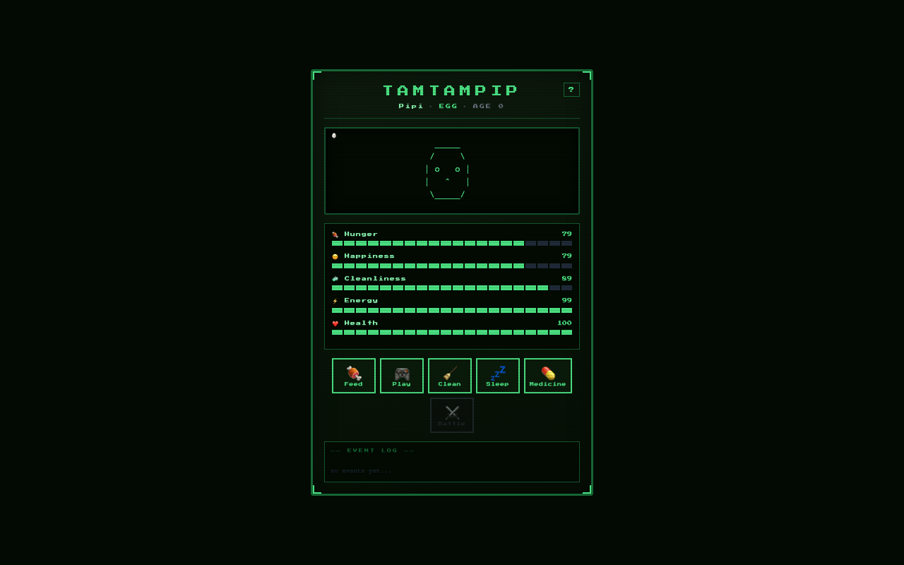

# TamTamPip 🥚

A Tamagotchi-inspired virtual pet game that runs entirely in the browser. Hatch, raise, and battle pixel-art pets through a retro LCD-styled interface — your pet is saved automatically so it keeps living between visits..

## Demo



<video src="demo.webm" controls width="100%"></video>

## Features

- **Full pet lifecycle** — Egg → Baby → Child → Teen → Adult over real hours
- **Care system** — Feed, Play, Clean, Sleep, and Medicine with per-action cooldowns
- **Stat decay** — Hunger, Happiness, Cleanliness, and Energy decay over time; 70% slower while sleeping
- **Sickness & death** — Neglect causes HP decay; reach 0 and it's Game Over
- **Browser persistence** — Pet state saved to `localStorage` automatically; survives page reloads
- **Turn-based PvE battles** — Attack, Defend, Special (3-turn cooldown), and Heal against randomised CPU opponents
- **Level & rank system** — Win battles to earn EXP, level up, and unlock rank titles (Rookie → Legend)
- **Interactive pet** — Wanders the screen, reacts to clicks, flees from poop, dances when happy, sneezes when sick
- **Retro LCD UI** — Press Start 2P font, scanlines, segmented stat bars, ASCII sprite animations

## Getting Started

```bash
npm install
npm run dev
```

Open [http://localhost:5173](http://localhost:5173) and name your pet to begin.

## How to Play

### Raising your pet

Your pet starts as an **Egg** and evolves through 5 stages based on real elapsed time:

| Stage  | Unlocks after |
|--------|--------------|
| Egg    | Start        |
| Baby   | ~10 min      |
| Child  | ~1 hour      |
| Teen   | ~4 hours     |
| Adult  | ~12 hours    |

Check in every few hours — it's a Tamagotchi, not a clicker game.

### Care actions

| Button    | Effect                              | Cooldown |
|-----------|-------------------------------------|----------|
| 🍖 Feed    | Hunger +25                          | 3 ticks  |
| 🎮 Play    | Happiness +30, Energy -15           | 3 ticks  |
| 🧹 Clean   | Cleanliness +35, removes poop       | 3 ticks  |
| 💤 Sleep   | Energy regens over time, auto-wakes | —        |
| 💊 Medicine| Health +30                          | 5 ticks  |

- Stats decay every 2 seconds (70% slower while sleeping)
- Average stats below 25 → health decays each tick
- Health below 30 → pet is sick, most actions locked

### Battle system

Unlocks at **Child** stage. Your care stats map directly to battle stats:

| Care stat    | Battle stat |
|--------------|-------------|
| Hunger       | Attack      |
| Cleanliness  | Defense     |
| Happiness    | Special     |

| Action    | Effect                                      |
|-----------|---------------------------------------------|
| ⚔️ Attack  | `max(1, attack - cpu.defense / 2)` damage   |
| 🛡️ Defend  | Reduces next incoming hit by 50%            |
| ✨ Special | `max(1, special × 1.5 - cpu.defense / 2)` — 3-turn cooldown |
| 💊 Heal    | Restores 20 HP (capped at max HP)           |

Win to earn EXP. Every 10 EXP = 1 level. Each level boosts all battle stats.

### Rank milestones

| Level | Rank       |
|-------|------------|
| 1     | 🥉 ROOKIE  |
| 5     | 🥈 FIGHTER |
| 10    | 🥇 VETERAN |
| 20    | 🏆 CHAMPION|
| 35    | 👑 LEGEND  |

### Pet behaviour

- Pet wanders left and right on its own
- 3+ poops → pet flees to the opposite side of the screen
- All stats above 80 → spontaneous happy dance 🕺
- Health below 30 → random sneezes
- Click the pet to interact (mood-based reaction: ♥ / ! / ...)
- Spam-click 4 times for a grumpy surprise 😤

## Tech Stack

- **React 19** with hooks
- **Vite** for dev server and bundling
- **Vitest** + **@testing-library/react** + **fast-check** for unit, component, and property-based tests
- **Press Start 2P** font via Google Fonts
- No backend, no external state — pure browser

## Running Tests

```bash
npm run test:run
```

## Project Structure

```
src/
├── constants/
│   ├── game.js              # Game constants, DEFAULT_PET, px font
│   └── sprites.js           # ASCII sprite frames per animation state
├── utils/
│   ├── petLogic.js          # Pure functions: decay, regen, evolution, battle stats
│   ├── battle.js            # Rank system, CPU name pools
│   └── storage.js           # localStorage save/load/clear
├── hooks/
│   ├── useGameLoop.js       # 2s tick: decay, evolution, death, cooldowns
│   ├── usePetActions.js     # Feed, play, clean, sleep, medicine handlers
│   ├── useBattle.js         # Battle init, player/CPU turn logic, EXP gain
│   └── usePetInteraction.js # Wander, click reaction, dance, sneeze, frame ticker
├── components/
│   ├── ActionButton.jsx     # Retro button with cooldown badge
│   ├── BattleScreen.jsx     # Battle UI with HP bars and action buttons
│   ├── EventLog.jsx         # Scrollable timestamped event log
│   ├── GameHeader.jsx       # Title, pet info, level, rank, help button
│   ├── HelpModal.jsx        # In-game manual overlay
│   ├── LogEntry.jsx         # Single log line with type colour
│   ├── NamePrompt.jsx       # First-launch name input screen
│   ├── PetViewport.jsx      # Animated sprite, wander, mood, attention alert
│   ├── StatBar.jsx          # Segmented retro stat bar
│   └── StatsPanel.jsx       # All stats + EXP bar
├── Tamagotchi.jsx           # Root component — wires hooks and components
├── main.jsx                 # App entry point
├── index.css                # Google Fonts import
├── test-setup.js            # Vitest + jest-dom setup
├── helpers.test.js          # Unit + property tests for petLogic utils
├── battle.test.js           # Unit + property tests for battle utils
└── [component/hook].test.*  # Co-located tests per component and hook
```
